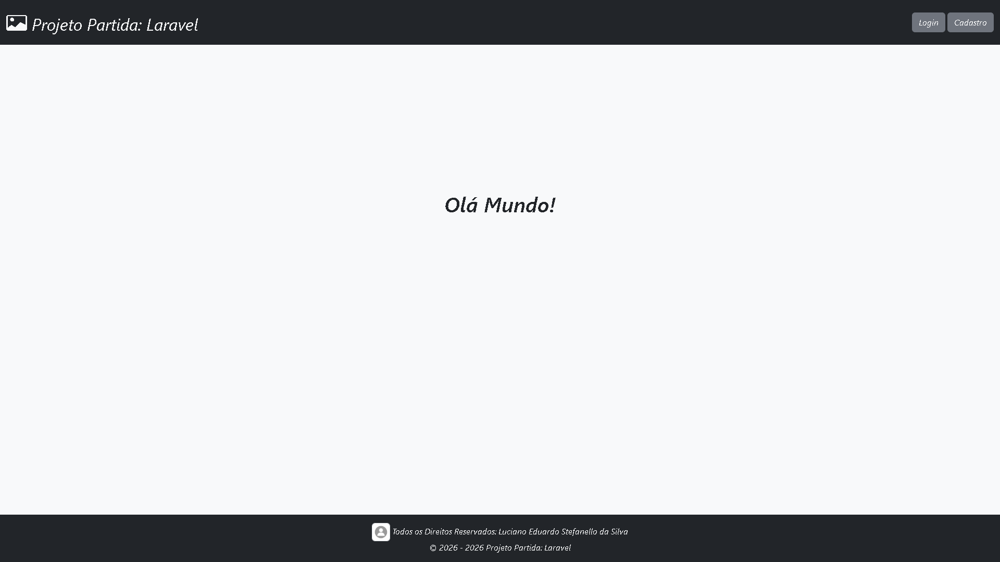

# 🌐 Projeto Partida

## 📜 Sobre

Aplicação web partida com **Laravel**, com foco em:

- ...

---

## ✨ Funcionalidades

- Cadastro, login, verificação.
- ...

---

## 🧱 Stack

- **Backend:** PHP 8.5.3 + Laravel 13
- **Frontend build:** Vite + CSS/JS
- **Banco de dados:** MySQL 8
- **Testes:** PestPHP (Feature/Unit tests)
- **Containerização:** ...

---

## 📁 Estrutura Principal

```text
app/
  Console/
    Commands/             # Fluxos automáticos
  Exports/                # Estrutura da tabela para exportação
  Http/
    Controllers/          # Fluxos principais (Register, Login, etc.)
    Middleware/           # Regras de acesso
  Imports/                # Estrutura da tabela para importação
  Models/                 # Entidades (User, Note, etc.)
  Services/               # Regras de negócio auxiliares
  View/                   # Contrutores dos componentes
config/                   # Configurações gerais
database/
  factories/              # Dados gerados
  migrations/             # Estrutura do banco
  seeders/                # Dados iniciais
docs/                     # Imagens usadas pelo site (Documentação)
public/
  assets/
    images/               # Imagens usadas pelo site (Fundos)
    js/                   # Respostas instantânias
resources/
  css/                    # Estilos personalizados
  views/                  # Telas Blade
routes/
  web.php                 # Rotas da aplicação
tests/                    # Testes automatizados
```

## 📸 Demonstração



---

## ✅ Pré-Requisitos

- PHP 8.5+
- Composer 2+
- Node.js 20+
- MySQL 8+

---

## 🚀 Como Rodar Localmente

1. Clone o projeto:

```bash
git clone <url-do-repositorio>
cd projeto-partida-laravel
```

2. Instale dependências PHP:

```bash
composer install
```

3. Instale dependências front-end:

```bash
npm install
```

4. Crie o arquivo de ambiente:

```bash
cp .env.example .env
```

5. Gere a chave da aplicação:

```bash
php artisan key:generate
```

6. Configure as variáveis de banco no `.env`.

7. Rode as migrations:

```bash
php artisan migrate
```

8. Rode as seeds:

```bash
php artisan db:seed
```

9. Suba o ambiente de desenvolvimento (server + queue + vite):
 
```bash
composer run dev
```

> O comando acima executa `php artisan serve`, `queue:listen` e `npm run dev` em paralelo.

---
 
## 🧪 Testes

Rodar suíte de testes:
 
```bash
php artisan test
```

Ou via Composer:
 
```bash
composer test
```
 
---

## ⚙️ Variáveis de Ambiente Importantes

Ajuste pelo menos:

- `APP_NAME`, `APP_ENV`, `APP_KEY`, `APP_DEBUG`, `APP_URL`
- `CACHE_STORE`
- `DB_CONNECTION`, `DB_HOST`, `DB_PORT`, `DB_DATABASE`, `DB_USERNAME`, `DB_PASSWORD`
- `LOG_CHANNEL`, `LOG_LEVEL`
- `MAIL_FROM_ADDRESS`, `MAIL_FROM_NAME`, `MAIL_HOST`, `MAIL_MAILER`, `MAIL_PASSWORD`, `MAIL_PORT`, `MAIL_SCHEME`, (Opcional)`MAIL_TIMEOUT`, `MAIL_USERNAME`
- `QUEUE_CONNECTION`
- `SESSION_DRIVER`, `SESSION_HTTP_ONLY`, `SESSION_SECURE_COOKIE`

---

## 🐳 Docker

Este projeto possui `Dockerfile` para facilitar execução/deploy.

Exemplo de build e run:

```bash
docker build -t projeto-partida-laravel .
docker run -p 8080:8080 --env-file .env projeto-partida-laravel
```

Comando de start definido no container:

```bash
php artisan migrate --force && php artisan optimize && php artisan config:cache && php artisan route:cache && php artisan view:cache && php artisan serve --host=0.0.0.0 --port=${PORT:-8080}
```

---

## ☁️ Deploy (Ex.: Railway)

Checklist recomendado:

1. Criar projeto usando o repositório do GitHub.
2. Criar e garantir que o banco MySQL esteja provisionado e acessível.
3. Configurar variáveis de ambiente de produção.
4. Rodar migrations e seeders no deploy (`php artisan migrate --force`, `php artisan db:seed --force`).
 
---

## 🗺️ Roadmap Técnico Sugerido (Melhorias)

- ...

---

## 👨‍💻 Autor

Projeto desenvolvido por: **Luciano Eduardo Stefanello da Silva**.
